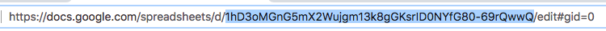

# Using Google Sheets as a Database (DB)

### Completed Examples and links
The [Google Sheet](https://docs.google.com/spreadsheets/d/1y3sqWKW1DwmLR-4HtA1e56rhd8y3rSs1KhtpsCjcFtU/edit#gid=0) being used to pull data from:
* Data only logged and visible in console:
  * https://pair-programmers.github.io/gas-stack/02-google-sheets-DB/
* Shows sheet data in html tables:
  * https://pair-programmers.github.io/gas-stack/02-google-sheets-DB/show-all-example.html

### Create the Sheet
To create a new sheet you must have a gmail account.
* Then, go to http://sheets.google.com
* Create New
  * Create your sheet with the top row as your key names.
  * See example above ☝️ a as reference.
* You must have something in at least 1 cell for this to work.
* Make sure to give your sheet a name.

Give view only access
* Find blue [Share] button (upper-right)
  * Select 'advanced'
  * Next to "Private - Only you can access" select 'change'
  * Select 'On - Public on the web'
  * next to > "Access: Anyone (no sign-in required)"
    * Make sure 'Can View' is selected.
  * NOTE: the link they provide is not what you want for this.
  * Select [Save] and select [Done]

Publish Url to the Web
* In your google sheet, select the File tab and find 'Publish to the Web'.
  * NOTE: the link they provide is not what you want for this.
  * exit from popup window.

You now can copy the 'sheet Id' from the *current url** in your browser.
* Ignore other links like those you would use to share the actual sheet!



* ☝️ This is your **Sheet Id**

### Add your sheet Id to demo html code
Copy the demo.html file into a new project folder.
* replace `_google_script_id` with **YOUR Sheet ID**

Now, if you structured your sheet similar to the demo, you should see your fields and values.
* Obviously all this can be changed to meet your needs, this is just a common DB format to follow.
* See console to find the object that matches your sheets

### Example code
```html
<!DOCTYPE html>
<html lang="en">
<head>
  <meta charset="UTF-8">
  <meta name="viewport" content="width=device-width, initial-scale=1.0">
  <meta http-equiv="X-UA-Compatible" content="ie=edge">
  <title> Google Sheets As Public DB With Clean Json and all Sheets  </title>
  <style> td { border: 1px solid; padding: 3px;} </style>
</head>
<body>
  <h1> Google Sheets as public DB </h1>
  Includes: <br>
  &bull; All "sheets" within Google Sheet <br>
  &bull; JSON to clean data structure with all sheets included (global object saved as"_sheets") <br>
  &star; See Console for object of sheets (option+command+j) <br>
</body>
</html>
<script>

// - - - - - - - - - - - 👇        YOUR SHEETS SCRIPT ID HERE          👇
const _google_script_id = "1y3sqWKW1DwmLR-4HtA1e56rhd8y3rSs1KhtpsCjcFtU"
var _sheets = {}

window.onload = ()=>{
  const _url = "https://spreadsheets.google.com/feeds"
  const _url_end = "/public/values?alt=json"
  _GET(_url+"/worksheets/"+_google_script_id+_url_end)
    .then(payload => _get_all_sheets(JSON.parse(payload.responseText).feed.entry))
}

_get_all_sheets = (data)=>{

  clean = (data, name)=>{
    let flatData = []
    for (field in data[0]) {
      const key = field.split('gsx$')[1]
      if (key) {
        for (let i = 0; i < data.length; i++) {
          if (!flatData[i]) flatData[i] = {}
          flatData[i][key] = data[i][field]['$t']
        }
      }
    }
    _sheets[name] = flatData
  }

  let sheets = []

  for (const sheet of data) {
    _sheets[sheet.content.$t]
    sheets.push(new Promise(function(resolve, reject) {
      _GET(sheet.link[0].href+"?alt=json")
        .then(payload => clean(JSON.parse(payload.responseText).feed.entry, sheet.content.$t))
        .then(resolve)
    }))
  }

  Promise.all(sheets)
    .then(x => console.log('All sheets object 👇 \n _sheets:', _sheets))

}


_GET = (url)=>{
  return new Promise((res, rej) => {
    let xhr = new XMLHttpRequest()
    xhr.open('GET', url, true)
    xhr.onreadystatechange = function () {
      if (this.readyState == 4) {
        if (this.status == 200) res(xhr)
        else rej(xhr)
      }
    }
    xhr.send(null)
  })
}

</script>
```
