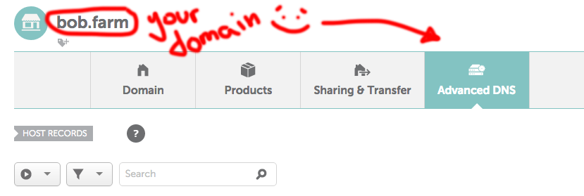
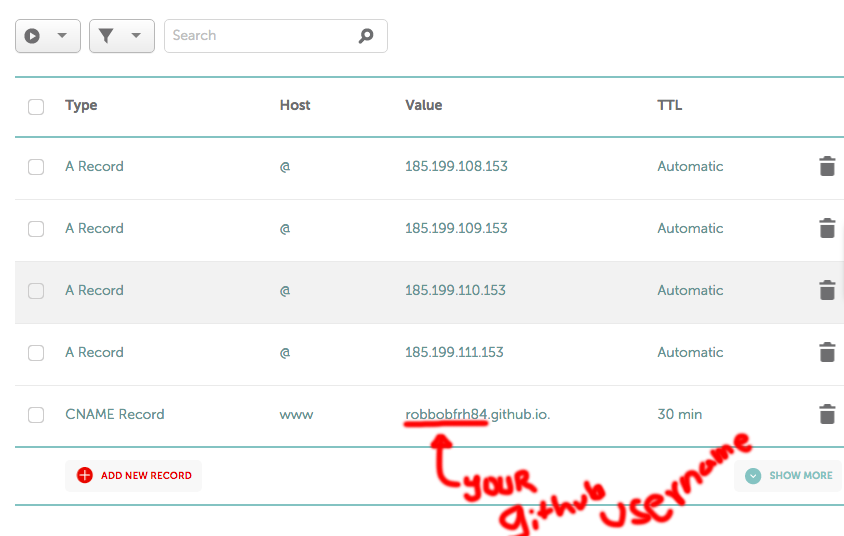
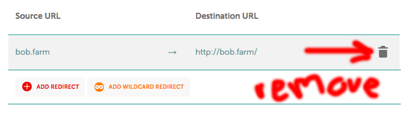

# Use your custom domain for your github pages repository. 
Note: this tutorial will use namecheap.com for it's example domain register. However, it is not necessary to use namecheap and other registers' interfaces are similar. 

### Setting up on github
Lets start out by saying you already got a github repository ready to host. No? start a new one and put the `index.html` file (found in this folder) in your repository and push those changes to get somethin' goin'. 

Select your repository and find the **settings** ⚙ Icon. 
* Scroll down until you find the **GitHub Pages** Section
* Here you'll see a 'source' section with a dropdown box below. It may show a branch already, or set to 'none'.
* Select **master branch** + [Save]
* **Custom domain** should have an entry available now. 
* put `example.com` 👈 Yep, that should be YOUR domian + [SAVE]
  * NOTE: **Don't add www.**
* [SAVE]

? Enforce HTTPS ?
* Forget that for now, you'll be able to add it later

Now, go checkout your repo again. 
* see `CNAME`, the new file created?
  * should just have `example.com` in it. Yep, that guy should stay riiiight there.  

### Setting up on your register
NOTE: This example uses namecheap.com, other registers may vary. But, should be similar

In your Dashboard on namecheap.com, find your domain name and click [manage]. 
* Remove any re-routs the may exist by default. 
  * They'll mess up re-routing procedures with Github. See 'Re-route errors' below,
* Find the tab that says [Advanced DNS]

* Now, you're going to add four `A Record`, Host: `@`, TTL: `automatic`
  * 185.199.108.153
  * 185.199.109.153
  * 185.199.110.153
  * 185.199.111.153
* Also add **YOUR** github username with with the `github.io` extension. 
  * example: `robbobfrh84.github.io` 
* Save 'em all! and... 
* Checkout your `example.com` in the browser!

Did it work? 
* Yes? Nice!
* NO? You may have to wait a few min. However, double check that everything is trimmed and isolated to what is directed here. Compare to this photos. 

### Delays
Delays may vary from region to region. In my experience, setting this up in Austin, TX, I was able to view my site live within a few minuets after setting up all the parts. 
* Remember to clear your cookies as they may cause additional delays. 
* Also, test on mobile devices using cellular data 

### Re-route errors:
You may get an error telling you the page re-routed too man times. See the image included and check that you're not re-routing unnecessarily. If your register is showing something similar to the example provided, you may **need to remove** the page forwarding to fix the rerouting errors.  

